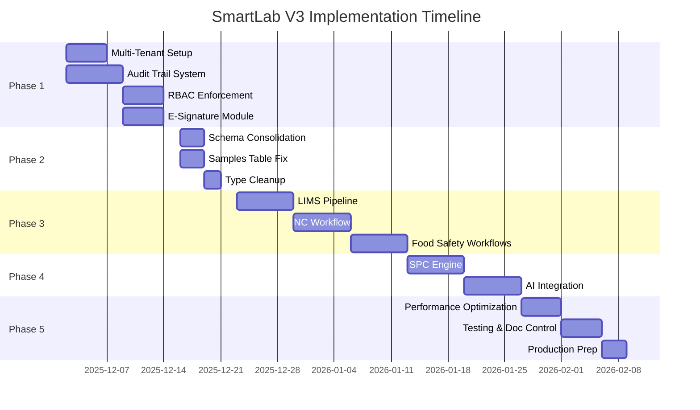

# SmartLab V3 - Implementation Roadmap

**Version:** 2.0  
**Start Date:** TBD (User Decision)  
**Target Completion:** 10 weeks from start  
**Current Status:** 40-45% complete (Code Review 2025-11-25)

---

## 🎯 Strategic Roadmap Overview



---

## 📅 Phase Breakdown

### Phase 1: Security & Compliance Foundation (Weeks 1-2)

**Dates:** Week 1-2  
**Duration:** 10 working days  
**Team Required:** 2-3 developers + 1 DBA  
**Priority:** 🔴 CRITICAL

#### Objectives
- ✅ Implement multi-tenant data isolation
- ✅ Establish comprehensive audit trail
- ✅ Enforce role-based access control (RBAC)
- ✅ Deploy electronic signature system

#### Milestones
| Milestone | Target Date | Success Criteria |
|-----------|-------------|------------------|
| All tables have tenant_id | End of Week 1 | 20+ tables updated, indexed |
| Audit triggers functional | End of Week 1 | All CRUD operations logged |
| RLS policies enforced | Mid Week 2 | No permissive policies remain |
| E-signature working | End of Week 2 | Password verification + immutable signatures |

#### Deliverables
1. Migration files for multi-tenant setup
2. Audit trigger SQL functions
3. Updated RLS policies (20+ tables)
4. E-signature library and UI components
5. Security audit report

#### Risks
- **High:** Breaking changes may affect existing data
- **Medium:** Performance impact of audit triggers
- **Mitigation:** Thorough testing on staging, performance benchmarks

---

### Phase 2: Data Model Cleanup (Week 3)

**Dates:** Week 3  
**Duration:** 5 working days  
**Team Required:** 2 developers  
**Priority:** 🔴 CRITICAL

#### Objectives
- ✅ Consolidate 53 migrations into coherent base schema
- ✅ Resolve samples vs lab_tests table confusion
- ✅ Complete migration to chosen production model
- ✅ Align TypeScript types with database schema

#### Milestones
| Milestone | Target Date | Success Criteria |
|-----------|-------------|------------------|
| Schema consolidated | Mid Week 3 | Single source of truth schema file |
| Samples table finalized | Mid Week 3 | One table, all queries updated |
| Type-schema alignment | End Week 3 | Zero type mismatches |
| All `any` types removed | End Week 3 | TypeScript strict mode passes |

#### Deliverables
1. Consolidated `schema_v2.sql`
2. Data migration scripts (if needed)
3. Updated TypeScript types
4. Migration documentation

#### Risks
- **Medium:** Data migration may require downtime
- **Low:** Type changes may require extensive refactoring
- **Mitigation:** Automated migration scripts, comprehensive testing

---

### Phase 3: Core Workflows Implementation (Weeks 4-6)

**Dates:** Weeks 4-6  
**Duration:** 15 working days  
**Team Required:** 3 developers  
**Priority:** 🟠 HIGH

#### Objectives
- ✅ Complete LIMS sample pipeline (registration → approval)
- ✅ Implement NC workflow with state machine
- ✅ Build 8D report wizard (D1-D8)
- ✅ Deploy PCC/OPRP/PRP monitoring systems

#### Week 4: LIMS Sample Pipeline
| Milestone | Target | Success Criteria |
|-----------|--------|------------------|
| Sample registration enhanced | Mid Week 4 | Zod validation, all sample types supported |
| Workflow system implemented | End Week 4 | Status transitions enforced |
| Analyst assignment working | End Week 4 | Drag-and-drop assignment |

#### Week 5: NC & 8D System
| Milestone | Target | Success Criteria |
|-----------|--------|------------------|
| NC workflow deployed | Mid Week 5 | State machine enforces sequence |
| 8D wizard complete | End Week 5 | All 8 disciplines captured |
| NC analytics dashboard | End Week 5 | Pareto, trends, costs displayed |

#### Week 6: Food Safety Workflows
| Milestone | Target | Success Criteria |
|-----------|--------|------------------|
| PCC monitoring live | Mid Week 6 | Auto-creates NC on deviation |
| OPRP system working | End Week 6 | Checklist execution |
| PRP tracking active | End Week 6 | Recurring tasks scheduled |

#### Deliverables
1. Sample workflow engine
2. NC state machine with permissions
3. 8D wizard with RCA tools
4. PCC/OPRP/PRP monitoring pages
5. Workflow user guides

#### Risks
- **Medium:** Complex state machine logic
- **Medium:** User training required for 8D
- **Mitigation:** Extensive unit testing, user acceptance testing

---

### Phase 4: Analytics & AI Implementation (Weeks 7-8)

**Dates:** Weeks 7-8  
**Duration:** 10 working days  
**Team Required:** 2 developers (1 with ML experience)  
**Priority:** 🟡 MEDIUM

#### Objectives
- ✅ Implement real SPC calculations (Cpk, Ppk, control limits)
- ✅ Deploy Western Electric rules detection
- ✅ Integrate AI for anomaly detection
- ✅ Build AI-powered root cause suggestions

#### Week 7: SPC Engine
| Milestone | Target | Success Criteria |
|-----------|--------|------------------|
| SPC calculations working | Mid Week 7 | Xbar-R, IMR, Cpk formulas correct |
| Rule detection active | End Week 7 | All 8 Western Electric rules detected |
| SPC dashboard enhanced | End Week 7 | Real calculations, violation markers |

#### Week 8: AI Integration
| Milestone | Target | Success Criteria |
|-----------|--------|------------------|
| Anomaly detection deployed | Mid Week 8 | AI identifies abnormal patterns |
| Root cause suggestions working | End Week 8 | Integrated with NC and 8D |
| AI assistant chat functional | End Week 8 | Context-aware responses |

#### Deliverables
1. SPC calculation library
2. Rule violation detection engine
3. AI anomaly detector
4. AI root cause suggestion system
5. AI assistant chat interface
6. AI usage cost analysis

#### Risks
- **High:** AI API costs may exceed budget
- **Medium:** AI suggestions may not be accurate
- **Mitigation:** Implement caching, rate limiting, user feedback loop

---

### Phase 5: Production Readiness (Weeks 9-10)

**Dates:** Weeks 9-10  
**Duration:** 10 working days  
**Team Required:** 3 developers + 1 QA  
**Priority:** 🟢 Required for Launch

#### Objectives
- ✅ Optimize performance (query, rendering, loading)
- ✅ Achieve >80% test coverage
- ✅ Implement Document Control module
- ✅ Complete production deployment preparation

#### Week 9: Performance & Quality
| Milestone | Target | Success Criteria |
|-----------|--------|------------------|
| All N+1 queries fixed | Mid Week 9 | No queries fetch in loops |
| Code quality improved | Mid Week 9 | Zero console.log, no `any` types |
| Input validation complete | End Week 9 | Zod schemas on all forms |
| Error handling standardized | End Week 9 | User-friendly error messages |

#### Week 10: Testing & Deployment
| Milestone | Target | Success Criteria |
|-----------|--------|------------------|
| Integration tests pass | Mid Week 10 | >80% coverage |
| Document Control deployed | Mid Week 10 | Version control working |
| Documentation complete | End Week 10 | User guides, API docs |
| Production ready | End Week 10 | All tests pass, security audit complete |

#### Deliverables
1. Optimized queries with proper joins
2. Comprehensive test suite
3. Document Control module
4. Complete documentation set
5. Production deployment guide
6. Go-live checklist

#### Risks
- **Medium:** Performance bottlenecks may be hard to fix
- **Low:** Documentation may be incomplete
- **Mitigation:** Early performance profiling, documentation templates

---

## 🚀 Launch Readiness Checklist

### Technical Readiness
- [ ] All critical bugs resolved
- [ ] Security audit passed
- [ ] Performance benchmarks met (dashboard < 2s)
- [ ] >80% test coverage achieved
- [ ] All integrations tested
- [ ] Database backup strategy in place
- [ ] Monitoring and alerting configured

### Compliance Readiness
- [ ] ISO 17025 requirements met
- [ ] 21 CFR Part 11 e-signature compliant
- [ ] Complete audit trail functional
- [ ] RBAC enforced across all modules
- [ ] Data integrity validated

### Operational Readiness
- [ ] User training completed
- [ ] Documentation accessible
- [ ] Support process defined
- [ ] Incident response plan ready
- [ ] Rollback procedure tested

### Data Readiness
- [ ] Production database configured
- [ ] Initial data migrated (if applicable)
- [ ] Master data setup (parameters, specs, products)
- [ ] User accounts created
- [ ] Tenant configuration complete

---

## 📊 Success Metrics & KPIs

### Development Metrics
| Metric | Target | Current |
|--------|--------|---------|
| URS Requirements Implemented | 90% | 40-45% |
| Test Coverage | >80% | ~20% |
| Code Quality (ESLint) | Zero warnings | TBD |
| Performance (Dashboard Load) | <2 seconds | TBD |
| Security Vulnerabilities | Zero critical | TBD |

### Business Metrics (Post-Launch)
| Metric | Target | Measurement Frequency |
|--------|--------|----------------------|
| User Adoption | 80% of QA team | Weekly |
| NC Resolution Time | <7 days average | Weekly |
| Sample TAT (Turnaround Time) | <24 hours | Daily |
| RFT (Right First Time) | >95% | Daily |
| System Uptime | 99.5% | Continuous |
| User Satisfaction | >4/5 stars | Monthly survey |

---

## 🔄 Agile Ceremonies

### Sprint Structure
- **Sprint Duration:** 2 weeks (aligned with phases)
- **Sprint Planning:** Monday Week 1, 2 hours
- **Daily Standup:** Every morning, 15 minutes
- **Sprint Review:** Friday Week 2, 1 hour
- **Sprint Retrospective:** Friday Week 2, 1 hour

### Backlog Management
- **Product Owner:** QA Manager/System Owner
- **Scrum Master:** Tech Lead
- **Backlog Grooming:** Wednesday each week, 1 hour
- **Priority:** CRITICAL → HIGH → MEDIUM → LOW

---

## 🛡️ Risk Management

### Critical Risks

| Risk | Probability | Impact | Mitigation Strategy | Owner |
|------|-------------|--------|---------------------|-------|
| Breaking changes affect production data | High | Critical | Comprehensive testing on staging, automated data migration scripts | DBA |
| Multi-tenant migration downtime | Medium | High | Schedule maintenance window, prepare rollback plan | DevOps |
| AI costs exceed budget | Medium | Medium | Implement caching, rate limiting, monitor daily costs | Tech Lead |
| E-signature delays | Low | High | Simple password verification initially, enhance later | Developer |
| Performance degradation with scale | Medium | Medium | Load testing with 100K+ records, optimize early | Developer |

### Risk Monitoring
- **Weekly risk review** in sprint planning
- **Daily risk escalation** in standup if critical
- **Mitigation progress tracking** in sprint board

---

## 👥 Team Structure & Responsibilities

### Core Team
1. **Tech Lead** (40%)
   - Architecture decisions
   - Code review
   - Technical roadmap

2. **Senior Full-Stack Developer** (100%)
   - Phase 1-2: Security & data model
   - Phase 3: Core workflows
   - Phase 5: Testing

3. **Full-Stack Developer** (100%)
   - Phase 3: LIMS & NC workflows
   - Phase 4: SPC & AI
   - Phase 5: Performance

4. **Database Administrator** (50%)
   - Schema design
   - Migration scripts
   - RLS policies
   - Performance optimization

5. **QA Engineer** (50%, Weeks 9-10)
   - Test plan creation
   - Integration testing
   - User acceptance testing
   - Bug triage

### Extended Team
6. **UI/UX Designer** (25%, as needed)
   - Workflow designs
   - Component refinements

7. **DevOps Engineer** (25%, Week 10)
   - CI/CD setup
   - Production deployment
   - Monitoring configuration

---

## 💰 Budget Estimate

### Development Costs
| Resource | Rate | Duration | Cost |
|----------|------|----------|------|
| Tech Lead (40%) | $80/hr | 200 hrs | $16,000 |
| Senior Developer | $70/hr | 500 hrs | $35,000 |
| Developer | $60/hr | 500 hrs | $30,000 |
| DBA (50%) | $75/hr | 250 hrs | $18,750 |
| QA Engineer (50%) | $50/hr | 100 hrs | $5,000 |
| **Total Labor** | | | **$104,750** |

### Infrastructure & Services
| Service | Monthly Cost | Duration | Total |
|---------|--------------|----------|-------|
| Supabase (Pro) | $25 | 3 months | $75 |
| Vercel (Pro) | $20 | 3 months | $60 |
| OpenAI API | $200 | 3 months (estimate) | $600 |
| SendGrid (Email) | $20 | 3 months | $60 |
| Monitoring (Sentry) | $30 | 3 months | $90 |
| **Total Infrastructure** | | | **$885** |

### Total Project Budget: ~$105,635

---

## 📈 Progress Tracking

### Weekly Progress Template
```markdown
# Week [N] Progress Report

## Completed
- [x] Task 1
- [x] Task 2

## In Progress
- [ ] Task 3 (50% complete)
- [ ] Task 4 (20% complete)

## Blocked
- [Blocker description with owner]

## Metrics
- Tasks Completed: 15/20 (75%)
- Test Coverage: 45%
- Sprint Velocity: 30 story points

## Risks
- [Any new risks identified]

## Next Week Plan
- Priority 1: [Task]
- Priority 2: [Task]
```

---

## 🎓 Training Plan

### Phase 3 Completion (Week 6)
**Audience:** QA Team (5-8 users)  
**Duration:** 4 hours  
**Topics:**
1. Sample registration and workflow
2. NC creation and investigation
3. 8D report wizard
4. PCC monitoring

### Phase 5 Completion (Week 10)
**Audience:** All users (20-30)  
**Duration:** 8 hours (2 sessions)  
**Topics:**
1. System overview and navigation
2. Role-specific workflows
3. E-signature procedures
4. Reporting and analytics
5. AI assistant usage

**Training Materials:**
- Video tutorials (10-15 minutes each)
- Quick reference cards
- Interactive walkthrough
- FAQs

---

## 📚 Documentation Deliverables

### Technical Documentation
1. **Architecture Document** - Updated with final design decisions
2. **Database Schema** - ER diagrams, table descriptions
3. **API Documentation** - All endpoints, parameters, responses
4. **Deployment Guide** - Step-by-step deployment instructions
5. **Security Documentation** - RBAC matrix, RLS policies, audit trail

### User Documentation
1. **User Manual** - Complete feature guide
2. **Admin Guide** - System setup and configuration
3. **Workflow Guides** - Step-by-step for each workflow
4. **Training Materials** - Slides, videos, exercises
5. **FAQ** - Common questions and answers

### Compliance Documentation
1. **Validation Report** - Evidence of testing
2. **Audit Trail Documentation** - How to retrieve audit logs
3. **E-Signature SOP** - Standard operating procedure
4. **Change Control Log** - All changes during development

---

## 🔗 Dependencies

### External Dependencies
- Supabase stability (database, auth, storage)
- OpenAI API availability
- Email service (SendGrid/Resend)
- Vercel deployment platform

### Internal Dependencies
- User decisions on architecture (multi-tenant strategy, data model)
- Access to production environment
- QA team availability for UAT
- Management approval for go-live

---

## ✅ Definition of Done

### Feature Level
- [ ] Code written and peer-reviewed
- [ ] Unit tests written and passing
- [ ] Integration tests passing
- [ ] Documentation updated
- [ ] Security considerations addressed
- [ ] Performance acceptable
- [ ] UI/UX approved

### Sprint Level
- [ ] All planned features complete
- [ ] Sprint goals met
- [ ] No critical bugs
- [ ] Demo prepared
- [ ] Retrospective completed

### Project Level (Go-Live)
- [ ] All phases complete
- [ ] >80% test coverage
- [ ] Security audit passed
- [ ] User training complete
- [ ] Documentation published
- [ ] Monitoring configured
- [ ] Rollback plan tested
- [ ] Stakeholder sign-off

---

## 🎯 Post-Launch Roadmap (Q1 2026)

### Month 1: Stabilization
- Daily monitoring
- Hot-fix releases
- User feedback collection
- Performance tuning

### Month 2: Enhancement
- Feature requests prioritization
- UI/UX improvements
- Additional reports
- Integration planning

### Month 3: Expansion
- Mobile app development (React Native)
- ERP integration (SAP)
- Advanced AI features
- Multi-language support

---

## 📞 Communication Plan

### Stakeholder Updates
- **Weekly:** Email update to management (Friday)
- **Bi-weekly:** Demo to stakeholders (Sprint review)
- **Monthly:** Executive summary report

### Team Communication
- **Daily:** Standup (15 minutes)
- **Weekly:** Tech sync (1 hour)
- **As-needed:** Slack for quick questions

### User Communication
- **Bi-weekly:** Feature preview newsletter
- **Weekly (Week 6+):** Training session announcements
- **Launch:** Go-live announcement with support contacts

---

**Roadmap Version:** 2.0  
**Last Updated:** 2025-11-25  
**Next Review:** Start of each phase  
**Maintained By:** Tech Lead

---

## Quick Links
- [Implementation Plan](./IMPLEMENTATION_PLAN_V2.md)
- [Task Breakdown](./TASKS_IMPLEMENTATION.md)
- [Code Review](../.gemini/antigravity/brain/e7fbfaea-2f72-4ce3-995f-a8f74ae0e535/code_review.md)
- [Project Repository](https://github.com/your-repo/smartlab-v3)
